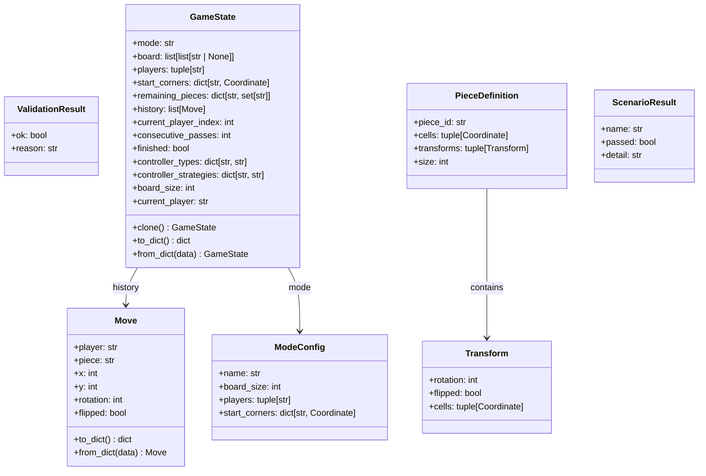

# Blokus Core Data Models

## Description
Represents the core data models in the Blokus engine:
- **Move**: Represents a single piece placement action
- **GameState**: Complete mutable game state containing board, players, and game progress
- **ValidationResult**: Wrapper for move validation success/failure
- **PieceDefinition**: Definition of a piece with all its unique geometric transforms
- **Transform**: One unique orientation of a piece (rotation + flip combination)
- **ModeConfig**: Static configuration for a game mode (board size, players, starting positions)
- **ScenarioResult**: Test fixture result with pass/fail and details
