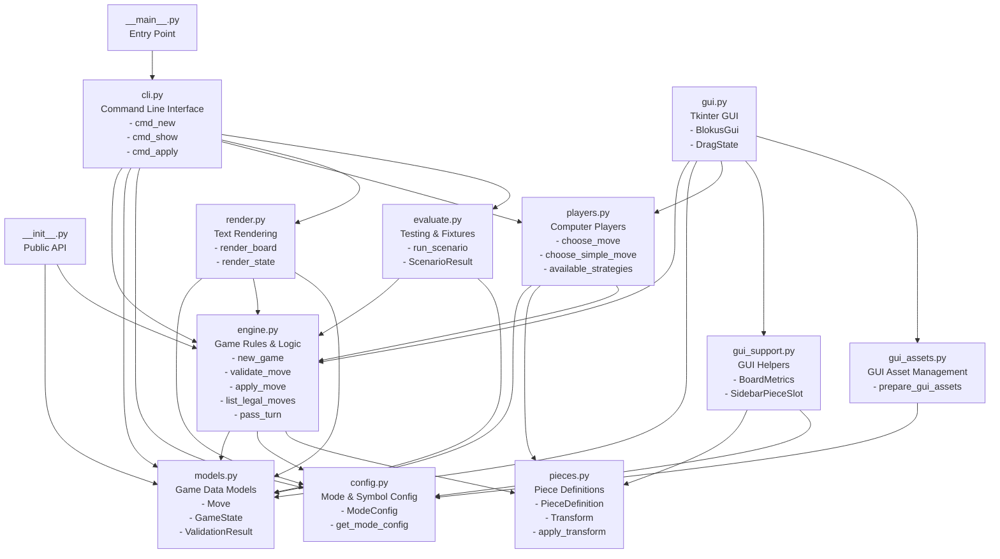

# Blokus Module Architecture

## Description
Shows the dependency structure of all 12 Python modules in the Blokus engine:
- **config.py**: Foundation - game mode and symbol configuration
- **models.py**: Core data structures built on config
- **pieces.py**: Piece definitions and transformation logic
- **engine.py**: Main game logic using models, config, and pieces
- **players.py**: AI/Computer player strategies using engine
- **cli.py**: Command-line interface orchestrating all modules
- **render.py**: Text rendering for terminal output
- **gui.py**: Tkinter GUI implementation
- **gui_support.py**: Helper functions for GUI
- **gui_assets.py**: Asset management for GUI
- **evaluate.py**: Testing framework using engine
- **__init__.py**: Public API exports
- **__main__.py**: Entry point for python -m blokus
