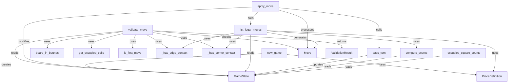

# Blokus Game Engine Core Functions

## Description
Core game engine functions and their interactions:

### Primary Functions
- **new_game()**: Creates initial GameState with empty board and all pieces available
- **validate_move()**: Checks if a Move is legal according to Blokus rules
- **apply_move()**: Updates GameState with a legal move
- **list_legal_moves()**: Generates all possible legal moves for the current player
- **pass_turn()**: Advances to next player when no legal moves exist

### Helper Functions
- **board_in_bounds()**: Coordinate boundary checking
- **get_occupied_cells()**: Retrieves all occupied board positions
- **is_first_move()**: Checks if player's turn is their first move
- **_has_edge_contact_with_player()**: Validates orthogonal touch requirement
- **_has_corner_contact_with_player()**: Validates diagonal corner placement

### Utility Functions
- **compute_scores()**: Calculates player scores based on occupied squares
- **occupied_square_counts()**: Returns occupied square count per player
