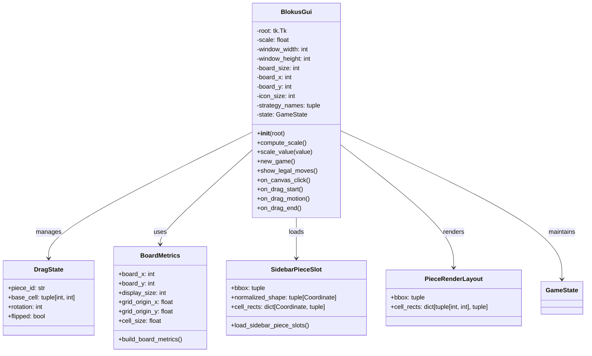

# Blokus GUI Architecture

## Description
Tkinter GUI architecture with supporting classes:

### Main Class
- **BlokusGui**: Main GUI window class managing the Blokus game interface
  - Handles window scaling and layout calculations
  - Manages piece drag-and-drop interactions
  - Renders board, pieces, and player controls
  - Maintains current game state

### Supporting Classes
- **DragState**: Tracks the piece currently being dragged, including rotation and flip state
- **BoardMetrics**: Calculates coordinate mappings between canvas pixels and board cells
- **SidebarPieceSlot**: Represents layout and hit-test information for sidebar piece UI
- **PieceRenderLayout**: Canvas rectangles for rendering and hit-testing individual pieces

### Supporting Modules
- **gui_assets.py**: SVG rasterization and asset caching for performance
- **gui_support.py**: Pure helper functions for GUI calculations
