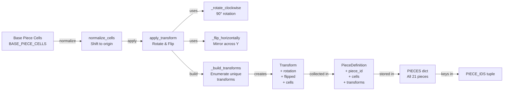

# Blokus Piece Transformation System

## Description
The piece transformation pipeline that generates all geometric variations:

### Base Definitions
- **BASE_PIECE_CELLS**: Dictionary defining the 21 canonical Blokus pieces

### Transformation Functions
- **normalize_cells()**: Shifts cell coordinates so top-left occupied square becomes origin
- **_rotate_clockwise()**: Rotates 90 degrees clockwise around local origin
- **_flip_horizontally()**: Mirrors across vertical axis through origin
- **apply_transform()**: Applies flip and rotation transformations in sequence, then normalizes

### Build Pipeline
- **_build_transforms()**: Enumerates all 8 possible transforms (2 flip states × 4 rotations)
  - Filters out duplicate symmetries to store only unique orientations
  - Creates Transform objects for each unique orientation

### Output Structures
- **Transform**: Dataclass containing rotation, flip, and normalized cells
- **PieceDefinition**: Canonical piece with piece_id, base cells, and all unique transforms
- **PIECES**: Dictionary mapping piece_id to PieceDefinition
- **PIECE_IDS**: Tuple of all 21 piece identifiers for easy iteration

### Result
21 pieces × variable unique transforms (depending on symmetry) = complete piece library used by game engine
