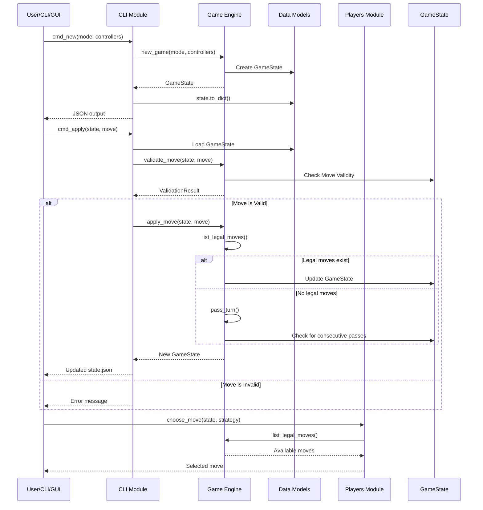

# Blokus Game Flow Sequence

## Description
Typical game flow interactions:

### Game Initialization
1. User requests new game with mode and controller configuration
2. CLI calls engine to create GameState
3. Engine creates board, initializes players, and loads all pieces
4. State is serialized to JSON and returned

### Move Execution
1. User (or GUI) submits a move
2. CLI loads the current game state
3. Engine validates the move against Blokus rules
4. If valid:
   - Move is applied to the state
   - Engine generates legal moves for next player
   - If legal moves exist, turn advances normally
   - If no legal moves, pass_turn() is called and pass counter increments
5. Updated state is serialized and returned

### AI Move Selection
1. Player module requests move for current player
2. Module queries engine for all legal moves
3. Module selects move based on strategy (e.g., prefer larger pieces)
4. Move is returned for execution
