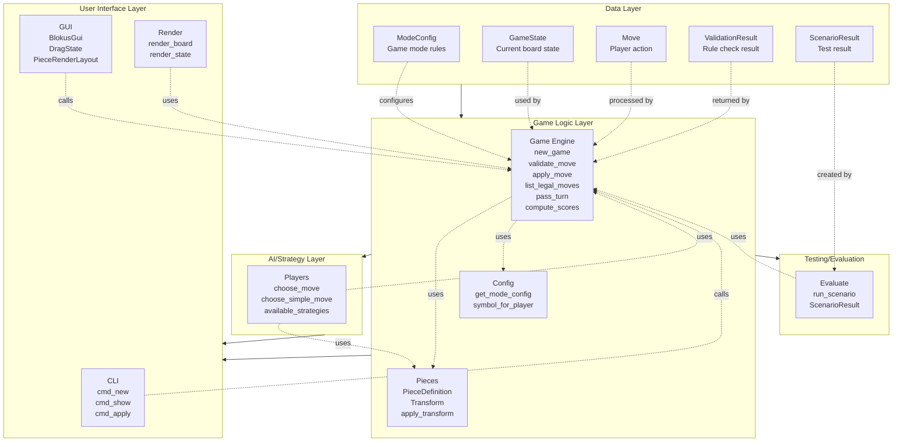

# Blokus Layered Architecture

## Description
Clean layered architecture organizing code by concern:

### Layer 1: Data Layer (Foundation)
- Immutable data structures representing game state
- **ModeConfig**: Configuration for different game modes
- **GameState**: Mutable container for current game state
- **Move**: Immutable action/move representation
- **ValidationResult**: Result wrapper for rule validation
- **ScenarioResult**: Test result wrapper

### Layer 2: Game Logic Layer
- Pure logic for game rules and piece handling
- **Engine**: Core game rules (validation, move application, legal move generation)
- **Pieces**: Piece definitions and geometric transformations
- **Config**: Game mode and player symbol configuration
- No UI or user interaction

### Layer 3: AI/Strategy Layer
- Computer player decision making
- **Players**: Strategy implementations for AI moves
- Uses game logic to find and evaluate moves
- Can be extended with additional strategies

### Layer 4: User Interface Layer
- Multiple presentations of the game
- **CLI**: Command-line interface with JSON I/O
- **GUI**: Tkinter graphical interface with drag-and-drop
- **Render**: Text rendering for terminal display
- All call into the game logic layer

### Layer 5: Testing/Evaluation
- Quality assurance and validation
- **Evaluate**: Fixture-based testing framework
- Allows scenario-based game testing
- Uses game engine directly

### Benefits
- **Separation of Concerns**: Each layer has a single responsibility
- **Testing**: Game logic can be tested independently
- **Reusability**: Multiple UIs can use same game engine
- **Extensibility**: New strategies, UI modes, or game rules can be added independently
